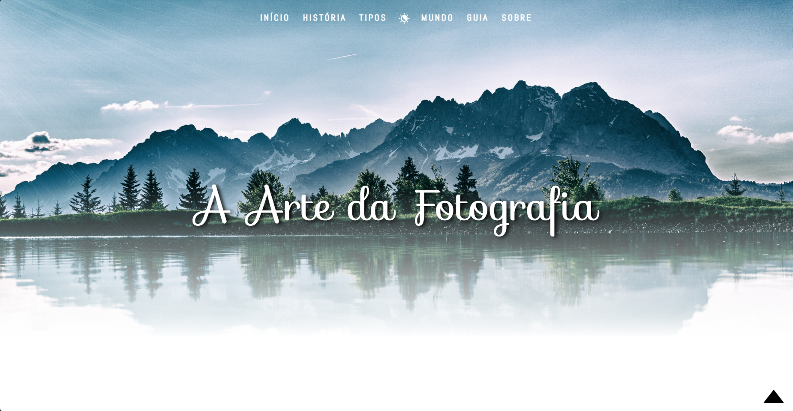
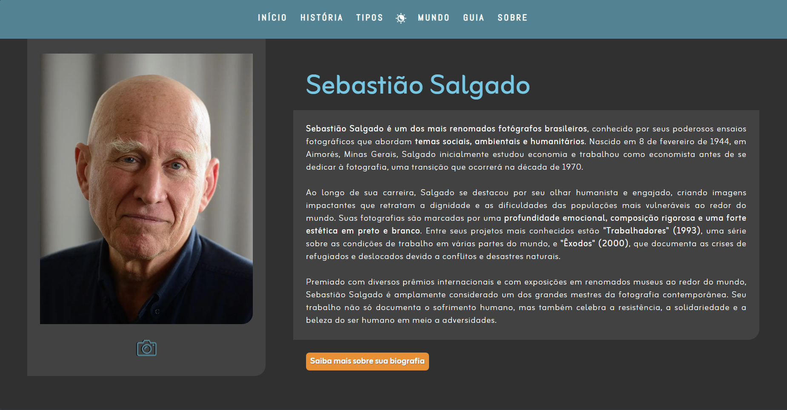

  
  # 📸 Site Fotografia em Foco

 Um site <strong>front-end responsivo</strong> sobre o universo da fotografia, desenvolvido para colocar em prática habilidades como <strong>HTML, CSS e JS</strong>. 

 

 <strong>❖ O projeto aborda alguns temas sobre fotografia, como: </strong> 

<ul>
  <li> História da fotografia </li>
  <li> 15 fotografias históricas </li>
  <li> 5 fotógrafos famosos </li>
  <li> Tipos e estilos de fotografias </li>
  <li> Destaques de premiações, como o Sony World Photography Awards 2024 </li>
  <li> Guia para iniciantes </li>
</ul>

 

 <strong> ❖ Principais funcionalidades: </strong> 

<ul>
  <li> 🌗 Tema claro e escuro: pode alterar os modos de visualização </li>
  <li> 📝 Formulários: estruturalmente prontos em HTML </li>
  <li> 🖼️ Galeria de imagens: apresentação organizada das fotografias </li>
</ul>

 

 <strong> ❖ Caso queira ver o preview do projeto, acesse o link abaixo: </strong> 

👉 [Fotografia em Foco](https://raiimiranda.github.io/Site-Fotografia)
